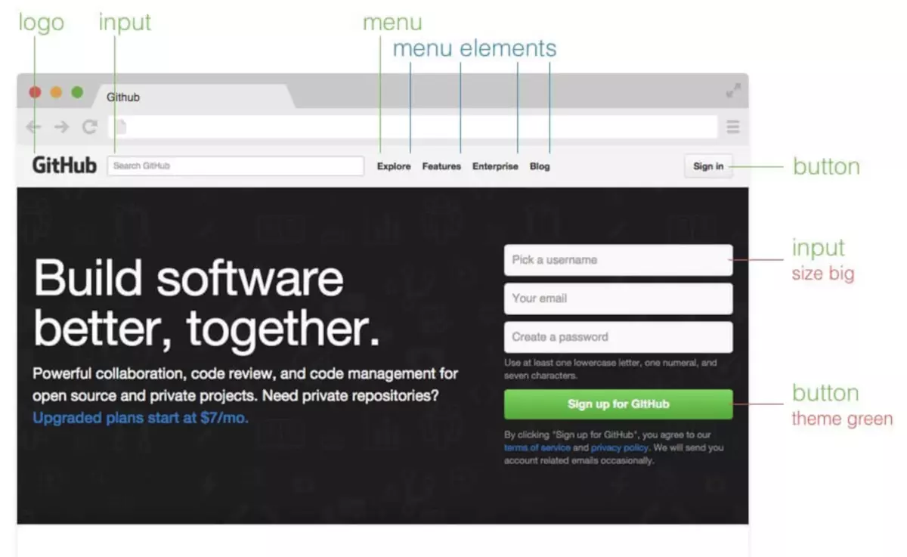

# 代码规范指南


## 前言

规范是为了提升代码质量，让代码可读、可维护、工作高效。

- 可读性：规范的变量、函数、熟悉的命名、顺序、组织结构统统是为了自己和别人阅读代码，一份好的代码应该首先是可读可的。

- 可维护性：按照规范写代码，本身就是一种注释，类型和变量命名意义明确要比通过注释解释模糊的命名好得多。一份不好的代码，过一个月自己都不好维护，如何让别人维护。

- 高效性：得益于上述的有点，按照规范的代码可以提高你读自己代码、读别人代码、交接别人代码、写新需求、改旧功能、找bug改bug等等诸多事情的效率，让你事半功倍的完成开发工作，有更多时间去做其他事情。

同时编写出eslint文件，对必须规范进行检测。强烈建议开启编辑器的eslint检查修复功能，项目会强制开启git hook在推送代码时检测代码是否通过eslint，同时会进行比较严格的code review保证代码质量。

## 通用规范

- utf-8编码（必须）
> 理由：编码一致，不希望因为编码导致“在我这里没问题啊”、“为何我的文件打不开”、“这乱码是什么鬼”等这样那样的问题。

- 2空格缩进（必须）
> 理由：没有理由，统一是必须的，2个和4个本身都是可行的。

- 文件命名（可选）
  > 理由：可读性好，项目好看，继承项目初始结构。

  - vue组件文件名全部使用大驼峰方式，并且与组件名一致，如PieChart.vue
  > 理由：与前者区别，与组件定义一致。

  - 页面组件名全部为大驼峰形式，并且其对应的路由名是，如DashBoard.vue对应路由是dash-board
  > 理由：对应路由可以方便直接用路由文件生成侧边栏导航、生成面包屑导航等功能，只需要维护一份文件。

  - 对于旧项目而言，不必遵守文件命名的规范，可以继续沿用旧规范。但弱旧规范命名混乱，则需要修正统一。
  > 理由：降低旧项目改造困难，而对于原项目文件命名已经有规范的，继续遵循开源减少工作量。

## vue（html template）规范

- 基本设置（必须）
  - 所有原生html标签和属性必须小写
  > 理由：如果不这么做，可能会和angular不兼容，因为微服务微前端架构等的兴起，同个项目不同框架的多页应用变的可行，不希望将来引入新架构后老文件变的不兼容了。

  - 所有原生html和vue模板，属性值一律使用双引号
  > 理由：统一是必须的，绝大多数编辑器自动补全是双引号。

- 组件名为多个单词（必须）
> 理由：这样做可以避免跟现有的以及未来的 HTML 元素相冲突，因为所有的 HTML 元素名称都是单个单词的。

``` js
/* 不推荐的 */
Vue.component('todo', {
  // ...
})
export default {
  name: 'Todo',
  // ...
}

/* 推荐的 */
Vue.component('todo-item', {
  // ...
})
export default {
  name: 'TodoItem',
  // ...
}
```

- prop 的定义应该尽量详细，至少需要指定其类型（必须）
> 理由：一目了然的知道prop是什么，并且在类型报错时可以顺利定位。

``` js
/* 不推荐的，可以在demo和原型中使用 */
props: ['status']

/* 推荐的 */
props: {
  status: String
}

/* 最好的 */
props: {
  status: {
    type: String,
    required: true,
    validator(value) {
      return [
        'syncing',
        'synced',
        'version-conflict',
        'error'
      ].indexOf(value) !== -1
    }
  }
}
```

- 为v-for设置index与key（必须）
> 理由：方便维护内部组件及其子树的状态，会增加vue列表渲染性能。

``` html
/* 不推荐的 */
<ul>
  <li v-for="todo in todos">
    {{ todo.text }}
  </li>
</ul>

/* 推荐的 */
<ul>
  <li
    v-for="todo in todos"
    :key="todo.id"
  >
    {{ todo.text }}
  </li>
</ul>
```

- 组件命名（可选）
  - 单文件组件的文件名应该要么始终是单词大写开头 (PascalCase)，要么始终是横线连接 (kebab-case)
  > 理由：单词大写开头对于代码编辑器的自动补全最为友好，而对于模板横线连接可以避免大小写不敏感的问题。

  ``` html
  /* 不推荐的 */
  <ul>
    <li v-for="todo in todos">
      {{ todo.text }}
    </li>
  </ul>

  /* 推荐的 */
  <ul>
    <li
      v-for="todo in todos"
      :key="todo.id"
    >
      {{ todo.text }}
    </li>
  </ul>
  ```

  - 只应该拥有单个活跃实例的组件应该以 The 前缀命名，以示其唯一性（可选）
  > 理由：增加项目可读性。

  ``` js
  /* 不推荐的 */
  components/
  |- Heading.vue
  |- MySidebar.vue

  /* 推荐的 */
  components/
  |- TheHeading.vue
  |- TheSidebar.vue
  ```

  - 和父组件紧密耦合的子组件应该以父组件名作为前缀命名（可选）
  > 理由：增加项目可读性与层级性。

  ``` js
  /* 不推荐的 */
  components/
  |- TodoList.vue
  |- TodoItem.vue
  |- TodoButton.vue

  /* 推荐的 */
  components/
  |- TodoList.vue
  |- TodoListItem.vue
  |- TodoListItemButton.vue
  ```

  - 组件名应该以高级别的、一般化描述的单词开头，以描述性的修饰词结尾（可选）
  > 理由：可以首先知道这个组件大概是什么东西，然后知道细节，此外与自然语法相反的这种描述是为了减少连接词的数量，否则组件名会变得很长。

  ``` js
  /* 不推荐的 */
  components/
  |- ClearSearchButton.vue
  |- ExcludeFromSearchInput.vue
  |- LaunchOnStartupCheckbox.vue
  |- RunSearchButton.vue
  |- SearchInput.vue
  |- TermsCheckbox.vue

  /* 推荐的 */
  components/
  |- SearchButtonClear.vue
  |- SearchButtonRun.vue
  |- SearchInputQuery.vue
  |- SearchInputExcludeGlob.vue
  |- SettingsCheckboxTerms.vue
  |- SettingsCheckboxLaunchOnStartup.vue
  ```

  - 对于绝大多数项目来说，在单文件组件和字符串模板中组件名应该总是 PascalCase 的——但是在 DOM 模板中总是 kebab-case 的（必须）
  > 理由：编辑器可以自动补全组件名，大驼峰保证了视觉的易识别性，但HTML是大小写不敏感，所以要使用横线连接式。

  ``` html
  /* 不推荐的 */
  <!-- 在单文件组件和字符串模板中 -->
  <mycomponent/>
  <!-- 在单文件组件和字符串模板中 -->
  <myComponent/>
  <!-- 在 DOM 模板中 -->
  <MyComponent></MyComponent>

  /* 推荐的 */
  <!-- 在单文件组件和字符串模板中 -->
  <MyComponent/>
  <!-- 在 DOM 模板中 -->
  <my-component></my-component>
  ```

- 在声明 prop 的时候，其命名应该始终使用 camelCase，而在模板和 JSX 中应该始终使用 kebab-case（可选）
> 理由：遵循js和html的命名习惯。

``` js
/* 不推荐的 */
props: {
  'greeting-text': String
}
<WelcomeMessage greetingText="hi"/>

/* 推荐的 */
props: {
  greetingText: String
}
<WelcomeMessage greeting-text="hi"/>
```

- 模板中的属性多于4个时候，分行写属性（可选）
> 理由：首先太多的话分行不好读，其次这样比较好看；少的话即使在一行读起来问题不大。

``` js
/* 不推荐的 */
<el-option v-for="item in options" :key="item.value" :label="item.label" :value="item.value" @click="getValue">
</el-option>

/* 推荐的 */
<el-option
  v-for="item in options"
  :key="item.value"
  :label="item.label"
  :value="item.value"
  @click="getValue">
</el-option>

  <el-button plain @click="open">可自动关闭</el-button>
```

- 指令全部使用缩写 ，用 : 表示 v-bind: 和用 @ 表示 v-on:（可选）
> 理由：一样的东西能少些为什么要多写。

``` js
/* 不推荐的 */
  <input
    v-bind:value="newTodoText"
    @focus="onFocus"
  >

/* 推荐的 */
  <input
    :value="newTodoText"
    @focus="onFocus"
  >

/* 最差的 */
  <input
    v-on:input="onInput"
    @focus="onFocus"
  >
```


## css 规范


- 空白与格式（可选）
  - 大括号与选择器之间留空，冒号后面留空
  > 理由：这样比较好看而且多数已有代码是这样。

  ``` css
  /* 不推荐的 */
  .el-pager{
    width:$--pagination-number-after-width;
  }

  /* 推荐的 */
  .el-pager {
    width: $--pagination-number-after-width;
  }
  ```

  - 在只有一条样式时允许和选择器写到同一行，但大括号首尾最好留一个空格。
  > 理由：写三行太浪费屏幕空间，留空格是为了读起来好看以及复制方便不至于把大括号给复制了

  ``` css
  /* 不推荐的 */
    .el-pager {
      width:$--pagination-number-after-width;
    }

  /* 推荐的 */
    .el-pager { width: $--pagination-number-after-width; }
  ```

  * 一个选择器中有多个样式声明时每条写一行
  > 理由：使报错可以精确到具体的规则上，便于排错。

  ``` css
  /* 不推荐的 */
    .el-pager {width:$--pagination-number-after-width; height: $--pagination-number-after-height; color: $--pagination-number-after-color;}

  /* 推荐的 */
    .el-pager {
      width: $--pagination-number-after-width;
      height: $--pagination-number-after-height;
      color: $--pagination-number-after-color;
    }
  ```

  - 多个选择器使用逗号隔开时写在不同的行，大括号不要另起一行
  > 理由：修改时不容易漏掉逗号后面的选择器。

  ``` css
  /* 不推荐的 */
    .el-pager, div {
      width:$--pagination-number-after-width;
    }

  /* 推荐的 */
    .el-pager,
    div {
      width:$--pagination-number-after-width;
    }
  ```

  - 每条样式声明后面都加上分号
  > 理由：复制起来方便。

  - 所有最外层引号使用双引号
  > 理由：与HTML保持一致。

  ``` css
  /* 不推荐的 */
    @import url(//www.google.com/css/maia.css);
    html { font-family: 'open sans', arial, sans-serif; }

  /* 推荐的 */
    @import url("//www.google.com/css/maia.css");
    html {
      font-family: "open sans", arial, sans-serif;
    }
    .selector[type="text"] { }
  ```

  - 用逗号分隔的多个样式值写成多行
  > 理由：便于阅读和编辑。
    ``` css
    /* 不推荐的 */
      .block {
        box-shadow: 0 0 0 rgba(#000, 0.1), 1px 1px 0 rgba(#000, 0.2), 2px 2px 0 rgba(#000, 0.3), 3px 3px 0 rgba(#000, 0.4), 4px 4px 0 rgba(#000, 0.5);
      }

    /* 推荐的 */
    .block {
      box-shadow: 0 0 0 rgba(#000, 0.1),
                1px 1px 0 rgba(#000, 0.2),
                2px 2px 0 rgba(#000, 0.3),
                3px 3px 0 rgba(#000, 0.4),
                4px 4px 0 rgba(#000, 0.5);
      }
    ```

- 功能限定（可选）
  - 避免使用ID选择器，如无必要禁止使用!important
  > 理由：权重太高，不易维护。

  - 禁止使用 @import 引入 CSS 文件，但在SCSS等预编译处理器中是允许的

  > 理由：兼容性差，并且会打破资源下载顺序有性能问题，在预编译器可以是因为不存在这个问题，打包工具会处理掉这个问题。

- 属性顺序（可选）
  - 位置属性(position, top, right, z-index, display, float等)
  - 大小(width, height, padding, margin)
  - 文字系列(font, line-height, letter-spacing, color- text-align等)
  - 背景(background, border等)
  - 其他(animation, transition等)
  > 理由：顺序从高到低依次和使用频率直接相关。

- 类命名规则（可选）
  - css命名建议采用BEM法。
  > 理由：可读性好（结构化），复用性好（），迁移性好。

  BEM 是 Block（块） Element（元素） Modifier（修饰器）的简称。

  

  块：独立的实体，它本身是有意义的。如header，container，menu，checkbox，input。

  元素：块的一部分，没有独立的含义，并且在语义上与其块相关联。如menu item，list item，checkbox caption，header title。

  修饰器：块或元素上的标志。用它们来改变外观或行为。如disabled，highlighted，checked，fixed，size big，color yellow。

  示例：
  看一个使用BEM的元素如何描述，以下三个按钮组。

  

  模板是：
  ```html
  <div> class="menu">
    <button class="button">
      Normal button
    </button>
    <button class="button button--state-success">
      Success button
    </button>
    <button class="button button--state-danger">
      Danger button
    </button>
  </div>
  ```
  样式是：
  ```css
  .button {
      display: inline-block;
      border-radius: 3px;
      padding: 7px 12px;
      border: 1px solid #D5D5D5;
      background-image: linear-gradient(#EEE, #DDD);
      font: 700 13px/18px Helvetica, arial;
  }
  .button--state-success {
      color: #FFF;
      background: #569E3D linear-gradient(#79D858, #569E3D) repeat-x;
      border-color: #4A993E;
  }
  .button--state-danger {
      color: #900;
  }
  ```

  - 类名中的字母一律小写
  > 理由：大小写对CSS是一样的，但难道统一大写或者首字母大写？

  - 类名中只是用用字母、数字以及“-”，并且尽量不要使用数字。
  > 理由：CSS类名可以用任何字符，但命名还是和js语言变量统一为好。

  ``` css
  .hello {} /* OK */
  .module-title {} /* OK */
  .panel-lebel--first /* OK */

  .panel-level1 {} /* NOT */
  .导航栏 /* Fuck */
  .にちな /* !@#$%^&* */
  ```

  - 除非是非常常见的缩写，否则类名使用完整英文单词或者抽调空格的英文词组
  > 理由：正常阅读，缩写可能不统一。
  ``` css
  /* 不推荐的 */
  .konnichiwa {} /* 非英文单词会导致大家无法正常阅读 */
  .modl {} /* 每个人的缩写未必一致，会造成不统一 */
  .hello-world {} /* 类名请只使用一个没有分隔[-_]的词 */

  /* 推荐的 */
  .module {}
  .helloworld {}
  .nav {}
  ```


- 属性规则
  - 0 值的单位建议省略，但不强制。
  > 理由：css中所有 0 值的单位是没用的。

  - 16进制颜色值中的字母统一为小写，并且可缩写的采用缩写为佳。
  > 理由：大小写对CSS是一样的，但切换大写麻烦。
  ```css
  /* 不推荐的 */
  .button {
    height: 0px;
    width: 20px;
    background: #DDDDDD;
  }

  /* 推荐的 */
    .button {
    height: 0;
    width: 20px;
    background: #ddd;
  }
  ```


- 预编译CSS的嵌套层级不要超过三层
> 理由：可读性好，并且超过三层很可能是抽离公共css做的不够导致的。
  ```scss
  /* 不推荐的 */
  .grand-father {
    .father {
      .child {
        .grand-child {
          // code
        }
      }
    }
  }

  /* 推荐的 */
  .grand-father {

  }
  .father {
    .child {
      .grand-child {
        // code
      }
    }
  }

  ```


## javascript 规范
- 严格模式：开启（必须）
> 理由：能够避免一些不精通js特性导致的坑，如==和===，得益于js早期糟糕的设计，有太多这样的问题。需要注意的是，严格模式在ie9下不兼容，但该项目是vue体系项目至少运行在ie10以上故不需要考虑。

- 引号：一律使用单引号（必须）
> 理由：可以和html的双引号更好的工作

- 分号：一律在语句结尾加分号（必须）
> 理由：首先官方新规范是要求分号的，可以避免不必要的坑。

  ```js
  /* 不推荐的 */
  let fn = {
    return 0
  }

  /* 推荐的 */
  let fn = {
    return 0;
  }; //这里有分号
  ```
- 空白与格式（必须）

在二元和三元运算符的符号与操作数之间添加空格，在非行末的 , ; } 后添加空格，在 { 前添加空格。并在每个逻辑块中间添加空白行。
特别的，在 if、while 等关键字后加空格，与函数调用做区分

```js
/* 不推荐的 */
let foo='bar',hello=foo+2,test=true;
function hi(){
  // ...
}
if(foo&&hello){
  // ...
}else if(foo){
  // ...
}else if(! test){
  // ...
}

/* 推荐的 */
let foo = 'bar';
let hello = foo + 2;
let test = true;
function hi(arg1, arg2) {
  // ...
}
if (foo && hello) {
  // ...
} else if (foo) {
  // ...
} else if (!test) {
  // ...
}
```
- 变量声明（必须）

  - 一个函数作用域中所有的变量声明尽量提到函数首部。
  - 如果可以使用 let 和 const 的，要使用 let 和 const。
  - 除了特殊情况如挂载全局jquery等外，不要定义全局变量。
> 理由：第一条是保证可读性，第三条和第四条是安全的作用域，

- 变量命名（必须）
  - 变量全部使用小驼峰，如
  - 常量使用大写匈牙利式命名法，如MAX_COUNT
  - 组件名必须为多个单词，如ConfigCenter
  - 组件名使用大驼峰命名，如ConfigCenter
  - 构造函数与类，大写第一个字母，如Person()
  - jquery 对象必须以'$'开头命名
  - 对象私有属性和方法，用'#'开头命名
  - 不要使用复数，对于变量而言，复数还是非负数都一样
  > 理由：可读性好，实际这是js与vue.js官方推荐的命名方式整合。

  ```js
  /* 推荐的 */
  var thisIsMyName; // 变量
  var MAX_COUNT = 10; // 常量
  function Person(name) { // 构造函数
    this.name = name;
  }
  var $body = $("body"); // jquery对象
  class Point { // 类
    #x; // 私有属性
    #y;

    constructor(x, y) {
      this.#x = x;
      this.#y = y;
    }
  }
  ```

- 括号（可选）

下列关键字后必须有大括号（即使代码块的内容只有一行）：if, else, for, while, do, switch, try, catch, finally, with。大括号如果是单行，前后要加一个空格。
> 理由：能够避免一些bug，提升可读性，方便复制代码而不复制到括号。

```js
/* 不推荐的 */
if (condition) doSomething();

/* 推荐的 */
if (condition) { doSomething() };
import { x, y } from myModule;
```

- 对于循环和判断代码，不要循环或判断三层以上。（可选）

- 能用ES6、ES7等新版本ES语法的，尽量用新语法，包括不仅限于：（部分必须）
  - 使用对象和数组的解构赋值的方式实现多个变量的赋值。
  ```js
  /* 不推荐的 */
  let [a, b, c] = [1, 'a', [ 2 , 3]]

  /* 推荐的 */
  let []
  ```
  - 使用拓展运算符...对参数对象中的所有可遍历属性进行拷贝。

  - 小函数使用箭头函数来替代function，这里要注意箭头函数作用域问题。

  - 使用字符串模板进行字符串拼接。

  - 使用安全的块级作用域语法let和const。

  - 使用Object.assign()进行对象的浅拷贝。

  - 使用Set去重，以及替代元素不重复的数组。

  - 使用class语法替代原有的方式。

  - 使用函数参数的默认值替代 || 语法
  ```js
  /* 不推荐的 */
  function f(x, y, z) {
    y = 1 || undefined;
    z = 2 || undefined
    return x + y + z;
  }

  /* 推荐的 */
  function f1(x, y = 4, z = 12) {
    return x + y + z;
  }
  ```

  - 使用对象中函数的缩写形式
  ```js
  /* 不推荐的 */
  let obj = {
    add: function() {}
  }

  /* 推荐的 */
  let obj =  {
    add() {}
  }
  ```
  - 使用Promise，async-await解决回调函数多层嵌套问题。


## 注释与文档规范

- 单行注释（必须）
  - 注释单独一行的情况下，注释的//后面要跟一个空格
  - 注释如果和代码同一行，代码分号结束后，要跟一个空格，注释的//后也要跟一个空格
> 理由：写起来简单，看上去直观。

```js
// 调用函数
foo();

var maxCount = 10; // 这是一个变量
```

- 多行注释（必须）

多行注释使用下面这种形式
> 理由：js统一的规范，官方也是这么写的。
```js
/**
 * 代码注释1
 * 代码注释2
 */
 ```

  多行注释建议在以下几种情况使用：
  - 难于理解的代码段
  - 可能存在错误的代码段
  - 浏览器特殊的 HACK 代码
  - 业务逻辑强相关的代码

- 函数注释（必须）

复杂的函数，所有类，都必须进行标准函数注释，示例如下。
> 理由：函数注释使用业界统一的规范，方便后续使用 jsdoc 生成文档。
```js
/**
 * 获取任务的名称
 * @param id {Number} 传入需要获取名称的人物id
 * @return {String} 返回的姓名
 * @author shi 2015/07/21 可以不写
 * @version 1.1.0 可以不写
 * @example 示例代码，可以不写
 */
function getTaskName(id) {
  let name = "test";
  return name;
}
```
