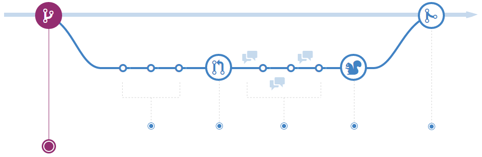
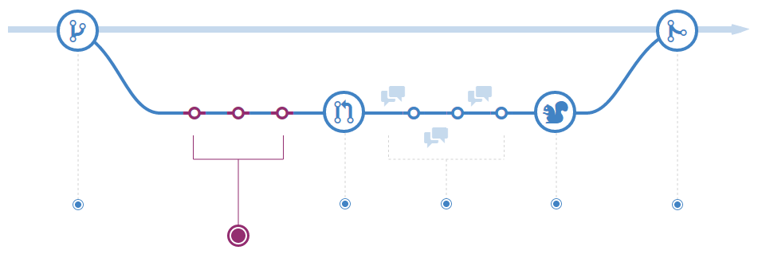
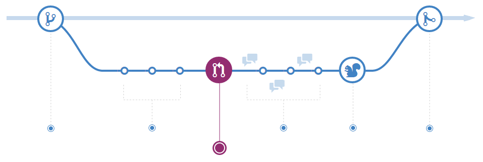
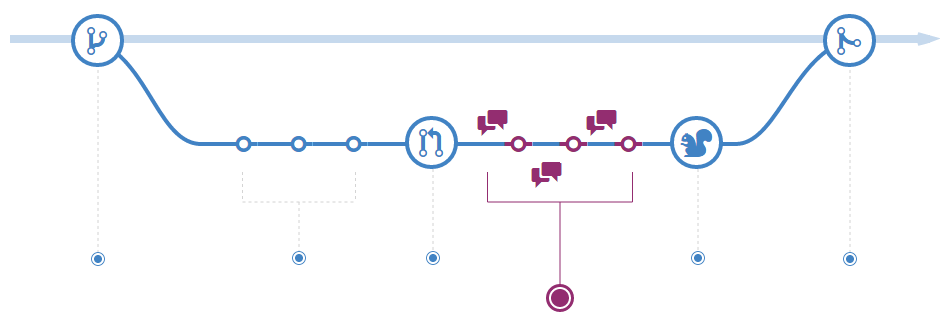
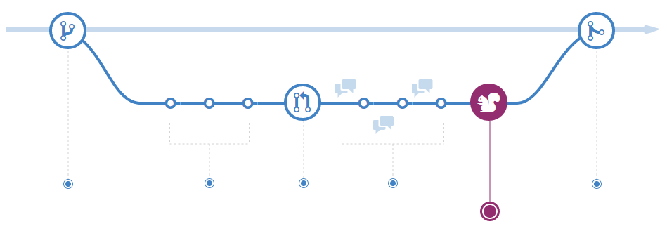
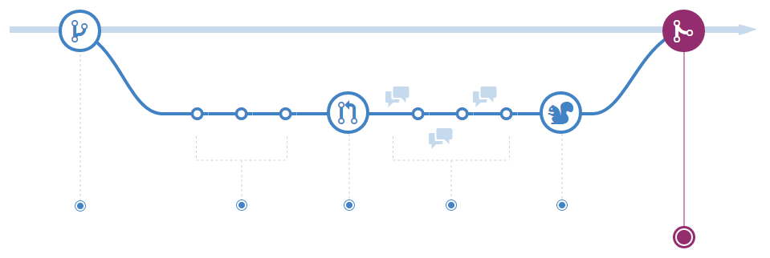

# GITHUB工作流

> GitHub工作流是一个轻量级的，基于分支的工作流，支持团队协作和规律发布的工程。本向导解释GitHub如何和为什么这样工作。

--------------

<ul>
    <li><a href="#一创建分支">一、创建分支</a></li>
    <li><a href="#二提交">二、提交</a></li>
    <li><a href="#三提Pull Request">三、提Pull Request</a></li>
    <li><a href="#四讨论和审查代码">四、讨论和审查代码</a></li>
    <li><a href="#五发布">五、发布</a></li>
    <li><a href="#六合并">六、合并</a></li>
</ul>

# 一、创建分支

当你想修改一个工程，你可以创建一个分支，在你的分支增加一些特征和你的想法（不管是已经想好的还是还没有想好）。分支让你能更好的管理你的工作。
当你创建一个分支，你就为你的想法创建了一个试验环境。你在分支上所做的修改不会影响到主干上的代码，所以你可以自由的尝试和提交你的代码。分支将不会被合并直到代码已做好让另一协作者审查。

> 专业提醒:
分支是Git的核心概念，整个GitHub工作流都是基于此的。这里有一个基本原则：任何主干上的版本都是可发布的。
所以，有一点就特别重要，你所创建的分支，不管是要新增特性还是修改bug，你的分支应该具有较好的描述性（如：refactor-authentication, user-content-cache-key, make-retina-avatars），这样其他人就可以看出是居于哪的。

# 二、提交
创建分支后，你就可以做些修改。无论什么时候你新增，修改，或是删除文件，你将会做一次提交来把你的修改加到你的分支上去。这样的提交过程便于你跟踪你在你分支上修改的进度。
提交为你的工作创建一个历史记录，通过这个记录，方便别人追踪和理解你所作的修改和为什么做这样的修改。每次提交都会有一个提交消息，你可以在此记录或解释你所作的修改。也可以这么说，每次提交可以被看成一次独立的修改单元。万一以后发现bug，代码可以回滚，或做其它的修改。

> 专业提醒:
提交消息很重要，特别是当你把你的修改提交到服务器以后。如果写好提交消息，那么别人在追踪和提交反馈时将变得更容易。

# 三、提Pull Request
提Pull Request为你的提交初始化一个讨论组。因为他紧密集成在Git repository下面，任何人可以清楚的看到如果他们接受的话，哪些修改将会被合并。
在开发过程中的任何时候，你都可以Open a Pull Request: 当你有一点点甚至没有修改代码，只想分享一些截图或一些点子，当你哪里没想清楚需要帮助或建议，或者当你已准备好让某人来检查你的代码。你可以在Pull Request message中使用GitHub’s@mention 系统，你可以请求某个特定的人或团队提供反馈，不管他是在你家客厅还是相隔十个时区以外。

> 专业提醒:
当贡献代码到开源工程或为共享库管理修改时，Pull Request时非常有用的。如果你使用Fork & Pull Model，Pull Request 提供一种方式来通知工程维护者关于你希望他们考虑的修改。如果你使用共享库模型，Pull Request 帮助我们在合并到主干之前进行代码审查和讨论哪些修改是恰当的。

# 四、讨论和审查代码
一旦Pull Request 被打开，其他个人或团队审查你的修改，他们可能会有问题或建议。有可能代码风格不符合主干的原则，有可能你的修改没有单元测试，亦或是其它任何觉得需要的东西。Pull Request 就是用来鼓励捕获这种类型的对话。
依据对你的提交的讨论和反馈，你可以继续提交修改你的分支。如果某人提醒你忘记了什么东西，或发现了一个bug，你可以在你的分支上修改并提交。GitHub将在一个统一的界面显示你新提交的信息和任何你新收到的反馈。

> 专业提醒:
Pull Request 建议用Markdown来写，这样你可以嵌入图片和表情符号，使用与格式化的文本块，和其他轻量级的格式。

# 五、发布
一旦你的pull request被审查通过，你可以发布你的修改以在产品中验证。如果你的分支或导致问题，你可以通过重新发布主干来回滚。

# 六、合并
现在你的修改已经在产品中验证通过，该是合并代码到主干的时候了。
一旦合并，Pull Request保存一份历史修改的记录到你的代码中。因为它是可搜索的，它让任何人及时了解但是为什么及如何做出这样的决定。

> 专业提醒:
通过在Pull Request中加入一些特定的关键字，你可以用代码辅助说明问题。当你的Pull Request 被合并，相关的问题也将被关闭。比如，输入词语 Close #32 代表关闭库中32号的问题。更多详情，参阅帮助文档
