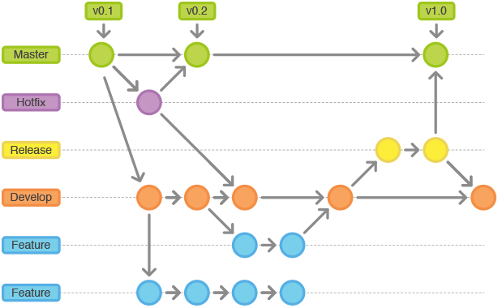

# 企业级Vue脚手架

## 运行项目

版本依赖：node>=10.17及其对应的npm，建议使用yarn做包管理器

```
$ yarn （安装依赖）
$ npm run dev （运行开发环境，项目会启动在8080端口）
$ npm run build （打包项目，项目会被打包到dist目录下）
```

## 目录结构
```
.
├── CODESTYLE.md（代码风格文档）
├── GITFLOW.md（工作流文档）
├── LICENSE
├── README.md（项目必读文档）
├── assets（文档中用到的静态资源）
├── babel.config.js（babel配置）
├── package.json
├── postcss.config.js（css预编译配置）
├── public
│   └── index.html
├── src（源码）
│   ├── App.vue（入口vue）
│   ├── api（api封装）
│   │   ├── BaseApi.js（api基类）
│   │   ├── UserApi.js（用户API类）
│   │   └── index.js
│   ├── assets（静态资源）
│   │   ├── css
│   │   └── img
│   ├── common（一些可选用模块）
│   │   ├── bus.js（全局bus通信）
│   │   └── directives.js（自定义指令）
│   ├── components（公共组件）
│   ├── main.js（入口）
│   ├── page（路由页面）
│   ├── public（公共）
│   │   ├── constant.js（常量）
│   │   ├── help.js（辅助函数）
│   │   └── storage.js（storage存储）
│   │   └── request.js（axios二次封装）
│   ├── store（vuex状态管理）
│   └── router（路由）
│   │   ├── home.js（home的路由）
│   │   └── index.js
├── .env.dev（dev环境变量）
├── .env.prod（prod环境变量）
├── .env.st（st环境变量）
├── .env.uat（uat环境变量）
├── vue.config.js（vue-cli配置）
└── yarn.lock
```


## 代码风格

参考[代码规范指南](./CODESTYLE.md)
希望尽量按照这个规范，会有eslint约定其中一部分规范，该eslint是对应是devops的sonar静态检测，项目地址为：https://github.com/rhythm1995/eslint-config-virgo，可以在项目中查看每一条的含义。


## Git工作流

一共有以下几种分支：
 - **master——最为稳定功能最为完整的随时可发布的代码；**
 - **develop——永远是功能最新最全的分支；**
 - hotfix——修复线上代码的 bug；
 - feature——某个功能点正在开发阶段；
 - release——发布定期要上线的功能。

其中「master」和「develop」是「主要分支」，其他的分支是基于它们派生出来的。主要分支每种类型只能有一个，派生分支每个类型可以同时存在多个。各类型分支之间的关系用一张图来体现就是：

  

不要直接在组织的原项目上进行开发。原因是为了避免原项目的主分支污染、做好分支管理、方便每次合并code review。请按照以下流程：

1. fork组织项目到自己仓库
2. git pull 自己仓库的项目。
3. 个人在「develop」分支开发项目。
4. git remote add upstream http://mayun.cmbchina.io/olp/LV02_OPBCFrontEnd   // 本地添加远程主分支。
5. git fetch upstream   // 获取主分支的最新修改到本地。
6. git merge upstream/develop   // 将远程分支的「develop分支merge到本地。
7. git push origin  // 将本地修改提交到个人分支。
8. 从自己仓库提pull request来合并本地「develop分支代码到远程仓库的「develop」。
9. 如果有冲突，解决冲突。
10. 如果没有冲突，管理员会进行code review，review通过后会合并到远程仓库的「develop」分支；review没有通过则修改后再次回到步骤7。

如果线上项目出现bug，需要紧急修复：
1. 从当前线上项目的「release」分支派生出一个「hotfix」分支。
2. 在「hotfix」上修改bug然后立即发布到线上。
3. 不要忘记在「master」分支把这个bug修改或者meger已修改的「hotfix」进去。

对于项目管理员，初次之外要做的事情有：
1. 每次用户提交后要做code review。
2. 把稳定版本
3. 对于某些版本需要打tag定版本号

如果这段简短的不足以解释清我们的工作流程，那需要看下[git工作流指南](./GITFLOW.md)。


## 提交规范
原则上一个故事点一个commit，例如一个最小颗粒度的新功能，一个bug的修改，一个单独组件的UI修改，一个测试用例，一个性能优化所做的修改。

```bash
  <type>(<scope>): <subject>

  参考：git commit -m 'fix(用户管理): 修复模板编译错误'
```
type 类型:

* feat：开发新功能（feature）
* fix：修补bug
* doc：写了文档（documentation）
* style： 格式（不影响代码运行的变动）
* refactor：重构（即不是新增功能，也不是修改bug的代码变动）
* performance：性能优化
* test：增加测试
* build：构建过程或辅助工具的变动


## 版本管理
项目管理员需要做版本管理，版本记录在package的vsersion中，为三位小数模式如1.2.3，前后端项目的版本一致，意义如下：
- 最高位1：表示一个不向下兼容的大版本
- 次高位2：每一个迭代周期所发的版本，主要是做了需求的版本
- 最低位3：小版本，主要是改了bug的版本
